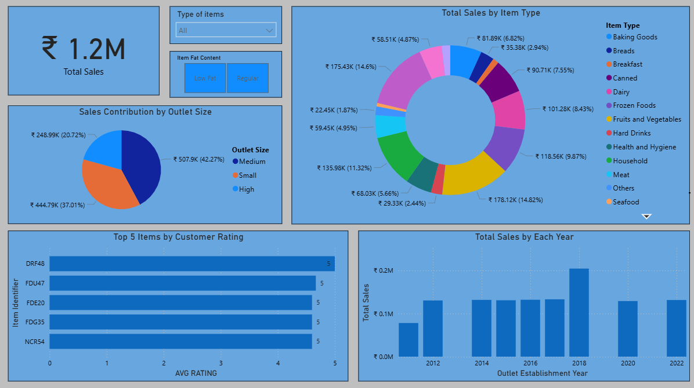
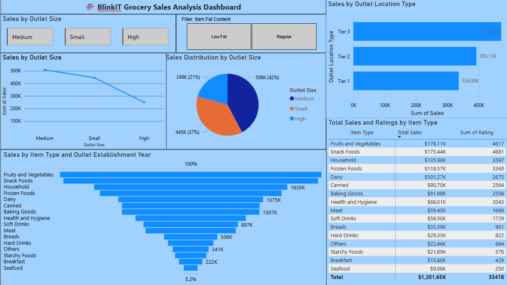

# BlinkIT Grocery Sales Analysis (Power BI)

## 📊 Overview
This project analyzes sales performance across BlinkIT outlets using Power BI.
It includes insights on:
- Outlet size and location type impact on sales
- Item category performance
- Average product ratings
- Year-wise sales trends

## 🧠 Tools Used
- Microsoft Power BI
- Excel (for data preprocessing)

## 📈 Dashboards
### Dashboard 1

### Dashboard 2

